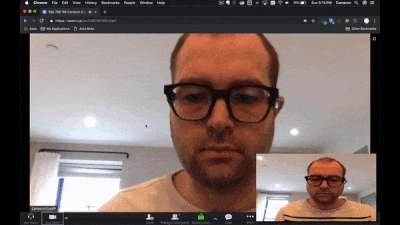
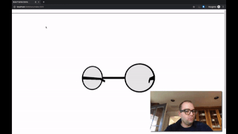
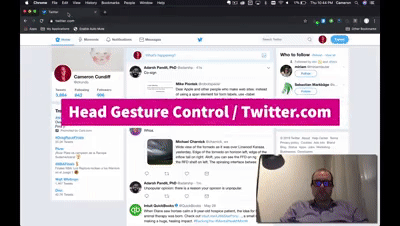
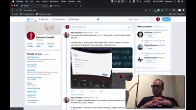
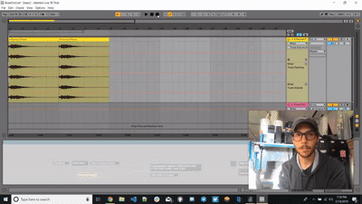
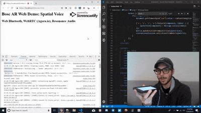
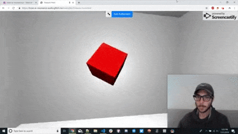
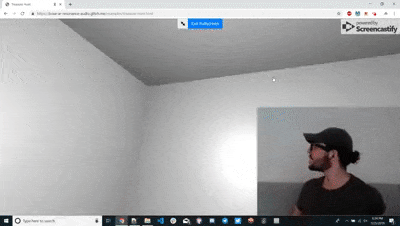
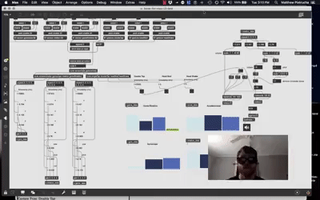
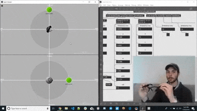

<a href="https://twitter.com/utopiah/status/1113829382269865984" target="_blank"></a>

# 🕶️ Bose AR Web SDK
_A JavaScript SDK for [Bose AR](https://www.bose.com/en_us/better_with_bose/augmented_reality.html)-enabled products, including the [Bose Frames](https://www.bose.com/en_us/products/frames/bose-frames-alto.html#v=bose_frames_alto_black_us), [Bose QuietComfort 35 Wireless II](https://www.bose.com/en_us/products/headphones/over_ear_headphones/quietcomfort-35-wireless-ii.html#v=qc35_ii_black), and [Bose 700 Wireless](https://www.bose.com/en_us/products/headphones/noise_cancelling_headphones/noise-cancelling-headphones-700.html#v=noise_cancelling_headphones_700_black) . [Click here](https://zakaton.github.io/Bose-Frames-Web-SDK/) for a Live Demo!_

## 📚 Table of Contents
[⚙️ Setting up the SDK](#-setting-up-the-sdk)

[🔓 Enabling and Disabling Sensors](#-enabling-and-disabling-sensors)

[🙇 Enabling and Disabling Gestures](#-enabling-and-disabling-gestures)

[👂 Listening for Events](#-listening-for-events)

[🛠️ Creating an Extension](#-creating-an-extension)

[🎛️ Bose for Max](#-bose-for-max)

[🏆 Developer Showcase](#-developer-showcase)

[🙏 Developer Wishlist](#-developer-wishlist)

## ⚙️ Setting up the SDK
0. Make sure you have a Web Bluetooth-enabled device
    - **Chrome for Desktop**: enable Web Bluetooth by going to `chrome://flags/#enable-experimental-web-platform-features` and check `Experimental Web Platform features` 
    - **iOS**: Use [this app](https://itunes.apple.com/us/app/webble/id1193531073?mt=8) to demo your web apps. Unfortunately iOS is [very negligent](https://github.com/WebBluetoothCG/web-bluetooth/blob/master/implementation-status.md) on various Web API's.

1. Update your [Bose AR-enabled](https://www.bose.com/en_us/better_with_bose/augmented_reality.html#Bose%20AR_tab1) headset's firmware [on their website](https://btu.bose.com/)

2. Disconnect your [Bose AR-enabled](https://www.bose.com/en_us/better_with_bose/augmented_reality.html#Bose%20AR_tab1) from your smartphone if you have the [Bose Connect App](https://www.bose.com/en_us/support/article/bose-connect-app-pulse.html) installed.

3. Save a local copy of [`bose-ar-web-sdk.min.js`](https://raw.githubusercontent.com/zakaton/Bose-Frames-Web-SDK/master/bose-ar-web-sdk.min.js)

4. In your HTML `<head></head>` element, insert the file in a script element:
```html
<script src="bose-ar-web-sdk.min.js"></script>
```

5. In your HTML `<body></body>` element, insert the following custom element:
```html
<bose-ar-device></bose-ar-device>
```
This element represents your Bose AR-enabled device, and will be used to interface with it. On your website the element will display a `🕶️` button that will attempt to connect with your Bose AR-enabled device when clicked, and become hidden once connected.

__NOTE: Bose AR devices have 2 types of Bluetooth Connections: an Audio connection (audio playback and microphone controls) and an AR connection (head-tracking and gestures). This SDK is used to establish an AR connection and will allow you to enable/disable sensors/gestures, as well as access the sensor/gesture data. If you want to access the Bose AR device as an audio device (like normal bluetooth headphones and headsets), you'll need to connect to it again "the usual way" and use the standard [Web Audio API](https://developer.mozilla.org/en-US/docs/Web/API/Web_Audio_API).__

__ALSO NOTE: You can connect to multiple Bose AR devices (as an AR device) simultaneously, as well as have a single Bose AR device be accessed from multiple browsers (e.g. your smartphone and laptop). However, disabling a Bose AR's sensor/gesture from one browser disables it for any browser observing the Bose AR device's sensors/gestures.__

__ALSO ALSO NOTE: The browser needs permission from the user to connect to the Bose AR device (as an AR device as mentioned in the first "NOTE"), but no action on the Bose AR device is needed (e.g. pressing a "connect" button on the Bose AR device). This means anyone can access an unassuming user's Bose AR device from their browser and enable/disable/read sensor/gesture data without the Bose AR device owner even knowing. I'm not sure why they designed them this way, but I don't work there.__

## 🔓 Enabling and Disabling Sensors
🔓 To enable sensors before runtime, add them as attributes in the custom element, with an attribute value indicating the refresh rate (in milliseconds or as a string):
```html
<bose-ar-device gyroscope=20 rotation="fast"></bose-ar-device>
```

🔓 To enable sensors during runtime, set the custom element's attribute:
```javascript
document.querySelector("bose-ar-device").setAttribute("rotation", "fast");
```

🔒 To disable sensors during runtime, remove the custom element's attribute:
```javascript
document.querySelector("bose-ar-device").removeAttribute("rotation");
```

👌 Valid sensor attributes:
  - `accelerometer`
  - `gyroscope`
  - `rotation`
  - `game-rotation`

⏲️ Valid sensor attribute values:
  - `20` or `"very-fast"`
  - `40` or "`fast"`
  - `80` or "`normal"`
  - `160` or `"slow"`
  - `320` or `"very-slow"`


## 🙇 Enabling and Disabling Gestures
🔓 To enable gestures before runtime, add them as attributes in the custom element:
```html
<bose-ar-device double-tap head-nod head-shake></bose-ar-device>
```

🔓 To enable gestures during runtime, set the custom element's attribute:
```javascript
document.querySelector("bose-ar-device").setAttribute("double-tap", '');
```

🔒 To disable gestures during runtime, remove the custom element's attribute:
```javascript
document.querySelector("bose-ar-device").removeAttribute("double-tap");
```

👌 Valid gesture attributes:
  - ~~`single-tap`~~ (coming soon)
  - `double-tap`
  - `head-nod`
  - `head-shake`

## 👂 Listening for Events
- To listen for sensor or gesture events, add an `eventListener` to the custom element:
```javascript
document.querySelector("bose-ar-device").addEventListener("accelerometer", yourCustomCallback);
```

👌 Valid event names:
  - `"accelerometer"`
  - `"gyroscope"`
  - `"rotation"`
  - `"gameRotation"`
  - ~~`"singleTap"`~~ (coming soon)
  - `doubleTap`
  - `"headNod"`
  - `"headShake"`

- To get the event data, you can get it from the custom element's attributes:
```javascript
document.querySelector("bose-ar-device").addEventListener("accelerometer", event => {
  const rotationX = Number(document.querySelector("bose-ar-device").getAttribute("rotationX"));
});
```

👌 Valid attributes for events:
  - `"accelerometer"`
    - `"accelerometerX"`
    - `"accelerometerY"`
    - `"accelerometerZ"`
    - `"accelerometerTimestamp"`
  - `"gyroscope"`
    - `"gyroscopeX"`
    - `"gyroscopeY"`
    - `"gyroscopeZ"`
    - `"gyroscopeTimestamp"`
  - `"rotation"`
    - `"rotationW"`
    - `"rotationX"`
    - `"rotationY"`
    - `"rotationZ"`
    - `"rotationYaw"`
    - `"rotationPitch"`
    - `"rotationRoll"`
    - `"rotationTimestamp"`
  - `"gameRotation"`
    - `"gameRotationW"`
    - `"gameRotationX"`
    - `"gameRotationY"`
    - `"gameRotationZ"`
    - `"gameRotationYaw"`
    - `"gameRotationPitch"`
    - `"gameRotationRoll"`
    - `"gameRotationTimestamp"`
  - ~~`"singleTap"`~~ (coming soon)
    - ~~`"singleTapTimestamp"`~~
  - `"headNod"`
    - `"headNodTimestamp"`
  - `"headShake"`
    - `"headShakeTimestamp"`


## 🛠️ Creating an Extension
1. Download the [extension folder](https://github.com/zakaton/Bose-Frames-Web-SDK/tree/master/extension)
2. Add your custom code in a Promise returned in [`injection.js`](https://github.com/zakaton/Bose-Frames-Web-SDK/blob/master/extension/injection.js) by the [`window.boseARDeviceElement.connect();`](https://github.com/zakaton/Bose-Frames-Web-SDK/blob/master/extension/injection.js#L20) method 
3. Customize the extension interface by adding buttons and sliders and stuff to [`popup.html`](https://github.com/zakaton/Bose-Frames-Web-SDK/blob/master/extension/popup.html)
4. Add eventListeners to the interface elements in [`popup.js`](https://github.com/zakaton/Bose-Frames-Web-SDK/blob/master/extension/popup.js), using [`sendMessage(message)`](https://github.com/zakaton/Bose-Frames-Web-SDK/blob/master/extension/popup.js#L2) to forward the event to the current website you're on. This message should include a `case` property value to specify the purpose of the message.
```javascript
    myButton.addEventListener("click", event => {
        const myMessage = {
            case : "myCase",
        };
        sendMessage(myMessage);
    });
```
5. Add your `case` string to the [`switch(event.data.case){}`](https://github.com/zakaton/Bose-Frames-Web-SDK/blob/master/extension/injection.js#L11) block in [`injection.js`](https://github.com/zakaton/Bose-Frames-Web-SDK/blob/master/extension/injection.js), which will receive the `message` object created in the previous step. Here you can define your custom behavior, using both the message case and any extra values you passed in the `message` object.
6. Load your extension into Chrome by going to `chrome://extensions/`, clicking `Load unpacked`, and selecting your edited `extension` folder.
7. You can change the name of the extension by going to [`manifest.json`](https://github.com/zakaton/Bose-Frames-Web-SDK/blob/master/extension/manifest.json) and changing the [`name`](https://github.com/zakaton/Bose-Frames-Web-SDK/blob/master/extension/manifest.json#L2) property.
8. You can change the icon by replacing [`icon.png`](https://github.com/zakaton/Bose-Frames-Web-SDK/blob/master/extension/icon.png) with your own image.

## 🎛️ Bose for Max
*Prefer [Cycling '74's](https://cycling74.com/) [Max](https://cycling74.com/products/max)? Now you can use as many [Bose AR](https://www.bose.com/en_us/better_with_bose/augmented_reality.html) devices as you want in a Max Patch using [Node for Max](https://cycling74.com/products/max-features#node-for-max) via [WebSockets](https://socket.io/)!*  
1. Download the [`bose-for-max`](https://github.com/zakaton/Bose-Frames-Web-SDK/tree/master/bose-for-max) folder
2. Open `bose-for-max.maxpat` in [Max](https://cycling74.com/products/max) *([Max 8](https://cycling74.com/products/max-features) is required for [Node for Max](https://cycling74.com/products/max-features#node-for-max).*
3. Go to `localhost:3000` to connect your BoseAR device via the WebSDK (the top of the webpage will display the socket connection index to distinguish multiple devices in the Patch)
4. Once connected, you can enable/disable sensors/gestures either in the Patch or the webpage
5. For multiple devices, copy-and-paste the BoseAR device region under `Bose AR Device #`, and change the # to indicate other devices via their socket connection index (shown at the top of the web page)

## 🏆 Developer Showcase
*Send us an email at zack@ukaton.com if you have a cool application made with our sdk!*
<a href="https://www.youtube.com/watch?v=SZagtIsUx9Q" target="_target"></a>
<br>
<a href="https://twitter.com/ckundo/status/1109872642520166400" target="_blank"></a>
<br>
<a href="https://twitter.com/ckundo/status/1109603745497784326" target="_blank"></a>
<br>
<a href="https://twitter.com/ckundo/status/1109563901463674881" target="_blank"></a>
<br>
<a href="https://twitter.com/utopiah/status/1115286049536843782" target="_blank"></a>
<br>
<a href="https://twitter.com/utopiah/status/1113829382269865984" target="_blank"></a>
<br>
<a href="https://twitter.com/ckundo/status/1132817208881614848" target="_blank"></a>
<br>
<a href="https://www.youtube.com/watch?v=W8UvGehtQvs" target="_blank"></a>
<br>
<a href="https://www.youtube.com/watch?v=ThkYJTmqIp4" target="_blank"></a>
<br>
<a href="https://www.youtube.com/watch?v=rk_SEOyMN9g" target="_blank"></a>
<br>
<a href="https://www.youtube.com/watch?v=sCJ7YQSfeyE" target="_blank"></a>
<br>
<a href="https://twitter.com/ckundo/status/1134293692225937414" target="_blank"></a>
<br>
<a href="https://twitter.com/ConcreteSciFi/status/1134181855379435520" target="_blank"></a>
<br>
<a href="https://twitter.com/ckundo/status/1135003825750839296" target="_blank"></a>
<br>
<a href="https://twitter.com/ConcreteSciFi/status/1150631793848197122" target="_blank"></a>
<br>
<a href="https://twitter.com/ConcreteSciFi/status/1154160202742059008" target="_blank"></a>
<br>
<a href="https://twitter.com/ConcreteSciFi/status/1156663791980912640" target="_blank"></a>
<br>
<a href="https://twitter.com/ConcreteSciFi/status/1154575658808299521" target="_blank"></a>
<br>
<a href="https://twitter.com/ConcreteSciFi/status/1162792737025875968" target="_blank"></a>
<br>
<a href="https://twitter.com/ConcreteSciFi/status/1149059903094321152" target="_blank"></a>


## 🙏 Developer Wishlist
*Our time is limited, so we'd greatly appreciate it if you guys could implement some of these ideas:*
- [ ] **Social Area Network** 🗺️🗫 - Place [voice recordings](https://developers.google.com/web/fundamentals/media/recording-audio/) on a [map](https://developers.google.com/web/fundamentals/native-hardware/user-location/) for others to hear (or only for yourself as a location-triggered notes app or to-do list).
- [ ] **Where You At?** 🤷 - Call a friend (or a group of friends) and know where they are by listening to what direction their voice is coming from, using [WebRTC](https://webrtc.org/) (or a WebRTC wrapper like [Simple-Peer](https://github.com/feross/simple-peer) to stream both [Voice](https://developers.google.com/web/fundamentals/media/recording-audio/) and [Location Data](https://developers.google.com/web/fundamentals/native-hardware/user-location/), as well as using the [Resonance Audio SDK](https://resonance-audio.github.io/resonance-audio/) for sound spatialization.
- [ ] **Yelp Radio** 🥡😋💬 🤤 - Hear Yelp reviews as you pass by restaurants, using your location and [Yelp's APIs](https://www.yelp.com/developers) to convert written reviews to speech using the [Web Speech API](https://developers.google.com/web/updates/2013/01/Voice-Driven-Web-Apps-Introduction-to-the-Web-Speech-API).
- [ ] **Twitter Extension** 🗨️🐦 - Go on [Twitter](https://twitter.com/) and convert [tweets to speech](https://developers.google.com/web/updates/2013/01/Voice-Driven-Web-Apps-Introduction-to-the-Web-Speech-API), listening to your feed in the background. You can even nod to "like" a tweet or double-tap to comment.
- [ ] **Spotify Spots** 🎵🗺️ - Use the [Spotify Web API](https://developer.spotify.com/documentation/web-api/) and [Location Data](https://developers.google.com/web/fundamentals/native-hardware/user-location/) to create playlists for frequent places and paths! You can curate your routine and play certain songs when you're at the gym, on the road, or at work.
- [ ] **Waze Gaze** 🚗👀 - Use the [Waze API](https://developers.google.com/waze/) and the [Resonance Audio SDK](https://resonance-audio.github.io/resonance-audio/) to alert users with sonified and spatialized notifications (e.g. play a police siren spatialized to their relative geolocation), and allow drivers share their own traffic alerts by saying what they see instead of looking down at the screen. (Additionaly, the gyroscope sensor can be used to detect speed bumps, and the rotation sensor can be used to know if the driver is looking in the direction they're driving in to prevent prolonged distraction). Plus, the [Spotify Web API](https://developer.spotify.com/documentation/web-api/) can be used to localize music/podcasts/audiobooks based on where the driver needs to go (e.g. panning the audio left or right if they need to make a turn soon).
